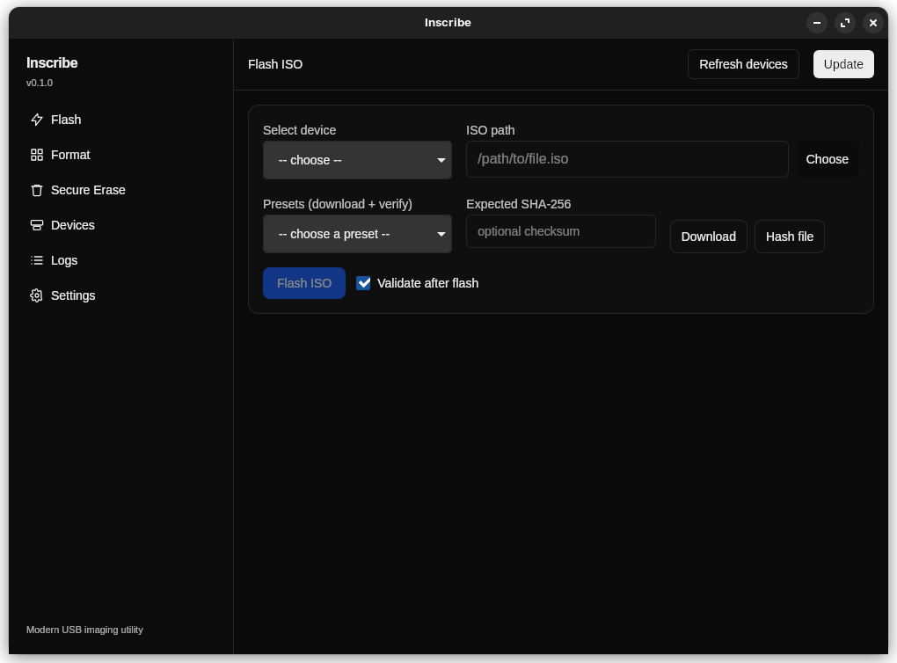

## Inscribe

Fast, elegant USB imaging for Linux. A modern, open‑source alternative to balenaEtcher — with a clean UI, clear progress, and power‑user controls.



## Highlights

- Flash ISOs to USB with smooth, real‑time progress and MB/s
- Secure erase (auto, zero‑fill, random, blkdiscard, wipefs)
- Quick format (ext4, FAT32, exFAT, NTFS) with custom label
- Built‑in presets and SHA‑256 verification
- Smart safety defaults (hide internal/system disks)
- One‑time privilege setup (pkexec/sudoers), no nagging prompts

## Download & Run

- Download the latest AppImage from Releases, then:
  - `chmod +x Inscribe_*.AppImage && ./Inscribe_*.AppImage`

## One‑click Updates

- Inside the app, hit “Update”. Inscribe checks the latest public release, downloads the matching `.AppImage`, atomically swaps it in place, and relaunches. Works when running as an AppImage.

## Safety

- Flashing/erasing destroys data on the selected drive. Double‑check the target path before you click.

## Tech notes

- UI: Next.js (App Router) + Radix UI, themed (light/dark/dim/OLED)
- Core: Tauri v2 (Rust). A tiny helper handles unmount/flash/erase/format with progress events.
- Works best on Linux with common CLI tools available: `dd`, `sgdisk`, `wipefs`, `blkdiscard`, `partprobe`, `mkfs.vfat`, `mkfs.exfat`, `mkfs.ntfs`, `pkexec`.

## Build from source

```
# from repo root
npm --prefix frontend ci
export NEXT_PUBLIC_GH_OWNER=reschjonas
export NEXT_PUBLIC_GH_REPO=Inscribe
npm run build

# AppImage output:
# src-tauri/target/release/bundle/appimage/Inscribe_<version>_amd64.AppImage
```

## Roadmap

- Inscribe is actively developed and will receive further updates.

## License

- Inscribe Community License (see `LICENSE`).
- TL;DR: use and modify freely with attribution; contributions welcome; don’t misrepresent the project as your own or strip credit.
